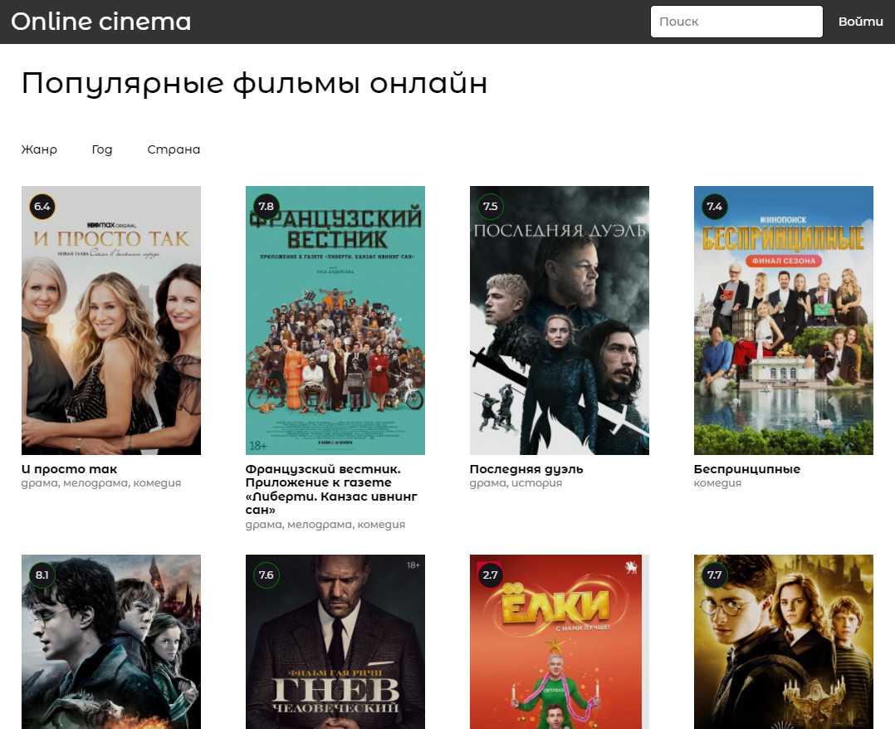

# Онлайн кинотеатр

В данном проекте представленна верстка и реализация части функционала онлайн кинотеатра.

## Цель проекта
1. Получение опыта работы по разделению проекта на модули.
2. Обучение в отправке сетевых запросов на сервер.
3. Обучение верстки модальных окон.
4. Получение опыта в стилизации бокового скролла

## Запуск проекта
### https://artem-suz.github.io/cinema-online-JS/

## Функционал
+ Поле **Поиск** осуществляет поиск фильмов по ключевым словам. 
+ Кнопка **Войти** вызывает модальное окно для входа пользлвателя.
+ Клик по банеру фильма приводит к переходу на макет проигрывателя и поиску похожих фильмов.
+ Кнопки **пагинации** подгружают по 20 фильмов из топ 100.
+ Кнопки **фильтрации** задают параметры для подгрузки 20 фильмов. PS(иногда ответ от сервера не быстро приходит).

## Используемые технологии

* [HTML](https://developer.mozilla.org/ru/docs/Learn/Getting_started_with_the_web/HTML_basics) - язык разметки веб-страницы.
* [SASS](https://sass-scss.ru/documentation/sintaksis/) - препроцессор CSS для описания внешнего вида HTML-документа
* [JS](https://developer.mozilla.org/ru/docs/Learn/JavaScript/First_steps/What_is_JavaScript) - язык программирования позволяющий создать динамичные веб-приложения.
* [Gulp](https://webdesign-master.ru/blog/docs/gulp-documentation.html) - сборщик проекта.

## Вид интерфейса

